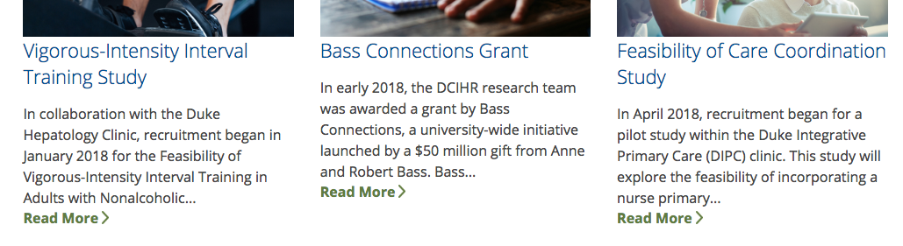
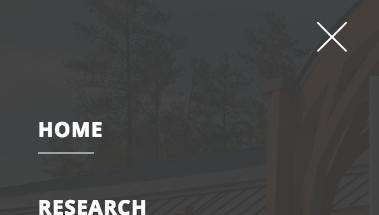
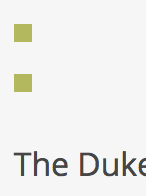

<style>
img { max-width:400px; height: auto;}
img,iframe {border: 1px solid #ccc;}
a { color: blue; }
pre code { font: 9px; }
pre { font: inherit; word-wrap: break-word; background: none; border: none; }
.force-thumbnail { width: 150px; }
.force-thumbnail img { height: auto; }
code {font: 9px;}
</style>


# DukeCenterForIntegrativeHealthResearch.org/ Assessment

__<https://dukecenterforintegrativehealthresearch.org/>__

__Screenshot 07/02/2018:__


Congratulations on everything the website has done to make it accessible so far. It is in better shape than most Duke websites, but there are still some important issues that need fixed to make it WCAG 2.0 AA compliant. This assessment is just for the homepage. Changes made to the header and footer should propagate to the subpages. If you want assessments of other pages, we can add them to our queue.

All of the issues will need fixed to be compliant, but issues marked as __[priority]__ will help people with disabilities most and mitigate legal risk.

Luckily most of the issues are very simple to fix. Below you will find a list of issues, as well as suggested solutions to remediate the problems.  Websites can fix the issues anyway they see fit, as long as the issues are fixed.

<details>
<summary>_Table of contents_</summary>

[TOC]

</details>


## [priority] The user's focus is not directed to new content added to the page

Description:<br>
If new content, such as a dialog, is added to the page, the user&#39;s focus is directed to it. [Learn more](https://developers.google.com/web/fundamentals/accessibility/how-to-review#start_with_the_keyboard).


### Search modal/popup issues

Currently, the search functionality is innaccessible to keyboard-only users as well as most screen reader users. Search is very important to people with sensory imparements as it can be used to find content quickly. Fixing this will be a big win, and is only a couple of lines of cut-paste.

Hiding he outline causes elements to not be keyboard accessibile. If they cannot see the focus outline they do not know where the focus is.

Comment out all `outline: none` instances in the modal css, and everywhere else. 

```css
.signup-form input:focus,.search-form input[type="submit"]:focus,.search-form input[type="text"]:focus {
-   /* outline:none; */
}
```


Replace part of the script near the footer with the following:

```js
/* onclick open the model then focus on the input */
$( "header .top-bar .search a" ).on("click", function() {
  $(".md-modal#modal-1").attr("aria-haspopup", "true").addClass("md-show");
  /* Need to set focus but must wait until animation is complete */
  setTimeout(function (){
    $(".md-modal#modal-1").find("#edit-custom-search-blocks-form-1--2").focus();
  }, 300);
});

/* onclick close the model then reset focus back to the search link */
$( ".md-content button.md-close" ).on("click", function() {
  $(".md-modal#modal-1").removeClass("md-show");
  $(".md-trigger a").focus();
});
            
```

Note: this won't fix every modal on the website. But it will fix it on the homepage.

[Please see gist](https://gist.github.com/jhc36-duke-edu/a10fcb2d489109da9d294e006fb664b1)


Lastly, add focus outline to search button:

Custom interactive controls are keyboard focusable and display a focus indicator. [Learn more](https://developers.google.com/web/fundamentals/accessibility/how-to-review#start_with_the_keyboard). The focus indicator is hidden on this link. To fix add the following CSS:

```css 
.search.md-trigger a:focus {
  border: 3px solid #4D90FE;
}
```


<br>

<hr>

<br>


## [priority] Users must be able to control automated content like time-based media (video or animation) 

The video on the homepage autoplays and loops. This can be distracting to people with A.D.D. or other cognitive imparement.

We can mitigate the problem by adding a pause or play button: 

### Looping homepage video

__HTML location:__

```html
<video id="hero-video" class="video" preload="metadata" autoplay="" loop="" muted="">
  <source src="/sites/dukecenterforintegrativehealthresearch.org/themes/cihr/video/hero-video.mp4" type="video/mp4">
</video>
```

__Visual location:__


#### Suggested Solution:

Add this JS anywhere that makes sense. It will generate a pause/play button. Style anyway you like.

```js
// add button
$('video').after('<button class="video-pause-button" style="position:relative;z-index:1000;">pause</button>');
// toggle play pause on click
$('.video-pause-button').on('click', function () {
    if ($(this).prev().get(0).paused) {
        $(this).text('play');
        $(this).prev().get(0).play();
    } else {
        $(this).text('pause');
        $(this).prev().get(0).pause();
   }
});
```
<br>

<hr>

<br>

## [priority] Content that is intended to be offscreen is not fully hidden from assistive technology

Manual Test: Offscreen content is hidden from assistive technology. All functionality on a website is requried to be keyboard accessible. In addition to keyboard accessibility problems it will also cause problems with screen readers. [Learn more](https://developers.google.com/web/fundamentals/accessibility/how-to-review#try_it_with_a_screen_reader).

### Mobile menu 

When navigating with tab and shift-tab mobile menu opens and gets stuck.

__Please watch video:__

<video width="600" height="480" controls>
  <source src="assets/off-screen--mobile-nav-problems.mp4" type="video/mp4">
  Your viewer does not support the video tag.
</video>

_Note: Onscreen keyboard shown to demonstrate the tab and shift key being used._


#### Suggested solution:

This is another easy. Add the following CSS where ever it makes sense to you:

```css
.st-menu {
  display:none;
}
.st-menu-open .st-menu {
  display:block;
}
```


<br>

<hr>


### [priority] "Read more" is not descriptive link text

Link text with the words "Read more" is not discriptive. The screen reader will reade _"Read more"_ to screen reader users. As a result, they will not know what the link does or where it will take them.

__HTML location:__

```html
<div class="views-field views-field-view-node">
  <span class="field-content">
    <a href="/content/vigorous-intensity-interval-training-study">Read More</a>
  </span>
</div>
```

__Visual location:__



#### Suggested solution:
Since the link already exists directly above this link, delete the _"Read more"_ Link. Or add [screen reader only text](https://accessible360.com/accessible360-blog/use-aria-label-screen-reader-text/) inside the link.


<br>

<hr>


## HTML5 landmark elements are not fully implemented  to improve navigation
Manual Test: HTML5 landmark elements are used to improve navigation

Description:<br>
Landmark elements (&lt;main&gt;, &lt;nav&gt;, etc.) are used to improve the keyboard navigation of the page for assistive technology. [Learn more](https://developers.google.com/web/fundamentals/accessibility/how-to-review#take_advantage_of_headings_and_landmarks).

### Main content is not in a landmark `<main>` element around the main content area

#### Suggested solution:

Wrap the main content in a `<main>` element.

```html
...
<div class="st-content">
  <div class="st-content-inner">
    <header>...</header>
+   <main>
      <div id="home-hero" class="section">...</div>
      <div id="home-section1" class="section">...</div>
      <div id="news-section" class="section">...</div>
+   </main>
    <footer>...</footer>
  </div>
</div>
...
```


### Missing Skip to link / bypass block missing. 

Adding ways to bypass repetitive content allows keyboard users navigate the page more efficiently. [Learn more](https://dequeuniversity.com/rules/axe/2.2/bypass).

The skip-to bypass block needs to be the first link on the page. When a user hits the tab key it gives it focus and as a result becomes visible. If the user hits the enter key while it is focused it will jump to the main content area.

#### Suggested solution:
Make the skip-to link bypass block jump to the main content area.


Keyboard and screen reader users expect the the skip-to link trigger to be the first focusable element in the `<body>` element.

```html
<body>
+  <div id="skip-link">
+    <a href="#main-content" class="element-invisible element-focusable">Skip to main content</a>
+  </div>
...
```

Add skip-to link target `<a id="main-content"></a>` after the header/above the main content area.

```html
...
<div class="st-content">
  <div class="st-content-inner">
    <header>
    ...
    </header>
+   <a id="main-content"></a>
  ...
```

Add the following CSS if it is not already there:

```css
.element-invisible {
    margin: 0;
    padding: 0;
    width: 1px;
    position: absolute !important;
    clip: rect(1px 1px 1px 1px);
    clip: rect(1px,1px,1px,1px);
    overflow: hidden;
    height: 1px;
}
.element-invisible.element-focusable:active, .element-invisible.element-focusable:focus {
    position: static !important;
    clip: auto;
    overflow: visible;
    height: auto;
}
```


<br>

<hr>


<br>

## Buttons do not have an accessible name

When a button doesn't have an accessible name, screen readers announce it as "button", making it unusable for users who rely on screen readers. [Learn more](https://dequeuniversity.com/rules/axe/2.2/button-name?application=lighthouse).


### This `button` or `input` has no `value` attribute or it contains no inner text to indicate its purpose

__Visual location:__




#### HTML location:

```html
<button id="closeMenu">
```

#### Suggested solution:

There are many ways to fix this issue:

__Option 1:__

Inside the `<svg>`, add:
`<title>Close Menu</title>`

Note: It _must_ be the first child of it’s parent element
will be used as a tooltip as the pointing device moves over it

[Please view Gist](https://gist.github.com/jhc36-duke-edu/9ed9d780b4a7dd2407e962fb090c0d58/revisions)

__Option 2:__

Add screen reader only text `<span class="element-invisible">Close Menu</span>`:

[Please view Gist](https://gist.github.com/jhc36-duke-edu/14b8499ca832e0c166585e1a1e07a2f3/revisions)

_Or try any of these:_

Fix all of the following:
<br>Element is in tab order and does not have accessible text

Fix any of the following:
<br>Element has a value attribute and the value attribute is empty
<br>Element has no value attribute or the value attribute is empty
<br>Element does not have inner text that is visible to screen readers
<br>aria-label attribute does not exist or is empty
<br>aria-labelledby attribute does not exist, references elements that do not exist or references elements that are empty or not visible
<br>Element&#39;s default semantics were not overridden with role=&#34;presentation&#34;
<br>Element&#39;s default semantics were not overridden with role=&#34;none&#34;

<details>
<summary>_Additional debugging details_</summary>
Selector:<br>
<code>1,HTML,1,BODY,0,DIV,1,NAV,1,BUTTON</code>

Path:<br>
<code>#closeMenu</code>

</details>

<hr>

<br>


<br>

## `[id]` attributes on the page are not unique

The value of an id attribute must be unique to prevent other instances from being overlooked by assistive technologies. [Learn more](https://dequeuniversity.com/rules/axe/2.2/duplicate-id?application=lighthouse).


### This element has an `id="Capa_1"` attribute that is that is duplicated in other locations.

__Visual location:__


__HTML location:__

```html
<svg version="1.1" id="Capa_1" xmlns="http://www.w3.org/2000/svg" xmlns:xlink="http://www.w3.org/1999/xlink" x="0px" y="0px" viewBox="0 0 491.858 491.858" style="enable-background:new 0 0 491.858 491.858;" width="30px" height="30px" xml:space="preserve">
```

####Suggested solution:

Open this `<svg>` image and remove the `id`. It is not necessary. This will fix this issues in multiple locations.

<details>
<summary>_Additional debugging details_</summary>
Selector:<br>
<code>1,HTML,1,BODY,0,DIV,4,DIV,0,DIV,1,DIV,1,HEADER,0,DIV,0,DIV,2,BUTTON,0,svg</code>

Path:<br>
<code>svg[viewBox="\30 \ 0\ 491\.858\ 491\.858"]</code>

More detailed explanation:<br>
Fix any of the following:
<br>Document has multiple elements with the same id attribute: Capa_1
</details>

<hr>

<br>


### This element has an `id` attribute that is duplicated in other locations.

__Visual location:__

Banner area:



Footer area:


__HTML location:__

```html
<div id="vert-squares">
  <span></span>
  <span></span>
</div>
```

####Suggested solution:

Change the ID in `<div id="vert-squares">` to `<div class="vert-squares">`

AND

Change the CSS selector from `#vert-squares` to `.vert-squares` in the following 4 locations:

[Please view Gist](https://gist.github.com/jhc36-duke-edu/20279863bf3592449339cd473880734c/revisions)

Check that the design did not change, since the edit changes the specificity of the CSS you may need to adjust the selector.

<details>
<summary>_Additional debugging details_</summary>
Selector:<br>
<code>1,HTML,1,BODY,0,DIV,4,DIV,0,DIV,1,DIV,3,DIV,0,DIV,0,DIV,0,DIV</code>

Path:<br>
<code>.left-side > div:nth-child(1)</code>

More detailed explanation:<br>
Fix any of the following:
<br>Document has multiple elements with the same id attribute: vert-squares
</details>

<hr>


<br>

## Links do not have a discernible name

Link text (and alternate text for images, when used as links) that is discernible, unique, and focusable improves the navigation experience for screen reader users. [Learn more](https://dequeuniversity.com/rules/axe/2.2/link-name?application=lighthouse).


### These three social media `<a>` links have no text inside.

__Visual location:__


__HTML Location__:

```html
<a class="svg" href="https://www.facebook.com/DukeIntegrativeMedicine" target="_blank">
```

```html
<a class="svg" href="https://www.linkedin.com/company-beta/3532515/" target="_blank">
```

```html
<a class="svg" href="https://twitter.com/DukeIM" target="_blank">
```


Empty links are not read to a screen reader user, as a result, they will have no idea what the link does or where it would take them.

#### Suggested solution:

There are many ways to fix this issue:

__Option 1:__

Inside the `<svg>`, add:
`<title>Facebook</title>`

Note: It _must_ be the first child of it’s parent element
will be used as a tooltip as the pointing device moves over it

[Please view Gist](https://gist.github.com/jhc36-duke-edu/696e2bab5f8d36d5e7ca4c57b91ad937/revisions)

__Option 2:__

Add screen reader only text `<span class="element-invisible">Close Menu</span>`:

[Please view Gist](https://gist.github.com/jhc36-duke-edu/9475742d8a5dbd5fe386e076053816cd/revisions)


<details>
<summary>_Additional debugging details_</summary>
Selector:<br>
<code>1,HTML,1,BODY,0,DIV,4,DIV,0,DIV,1,DIV,5,FOOTER,0,DIV,0,DIV,3,DIV,1,DIV,0,DIV,0,A</code>

Path:<br>
<code>.facebook > .svg[target="_blank"]</code>

More detailed explanation:<br>
Fix all of the following:
<br>Element is in tab order and does not have accessible text

Fix any of the following:
<br>Element does not have text that is visible to screen readers
<br>aria-label attribute does not exist or is empty
<br>aria-labelledby attribute does not exist, references elements that do not exist or references elements that are empty or not visible
<br>Element&#39;s default semantics were not overridden with role=&#34;presentation&#34;
<br>Element&#39;s default semantics were not overridden with role=&#34;none&#34;
</details>

<hr>


<br>


## Browser errors were logged to the console

Errors logged to the console indicate unresolved problems. They can come from network request failures and other browser concerns.


__Error:__

```
TypeError: Cannot read property 'querySelector' of null
    at https://dukecenterforintegrativehealthresearch.org/sites/dukecenterforintegrativehealthresearch.org/themes/cihr/js/modalEffects.js:20:19
    at Array.forEach (<anonymous>)
    at init (https://dukecenterforintegrativehealthresearch.org/sites/dukecenterforintegrativehealthresearch.org/themes/cihr/js/modalEffects.js:17:63)
    at https://dukecenterforintegrativehealthresearch.org/sites/dukecenterforintegrativehealthresearch.org/themes/cihr/js/modalEffects.js:55:2
    at https://dukecenterforintegrativehealthresearch.org/sites/dukecenterforintegrativehealthresearch.org/themes/cihr/js/modalEffects.js:57:3
```

#### Suggested solution:

https://stackoverflow.com/questions/22135631/problems-with-modal-windows
 


<hr>


